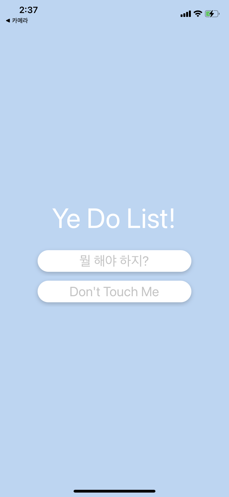
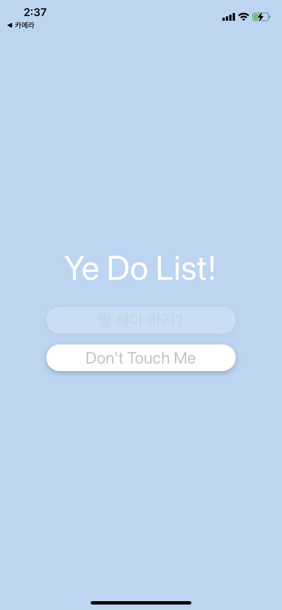
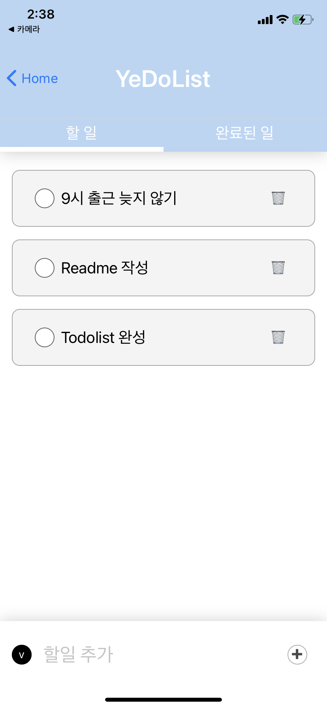
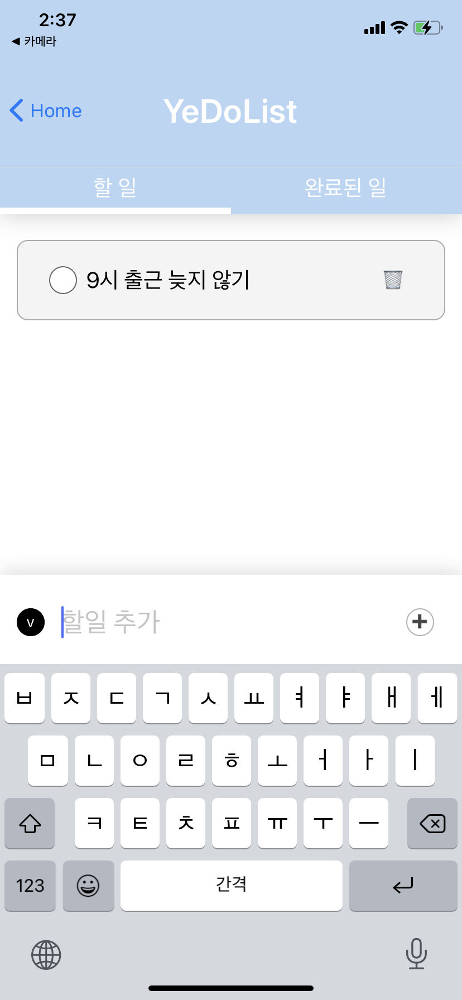
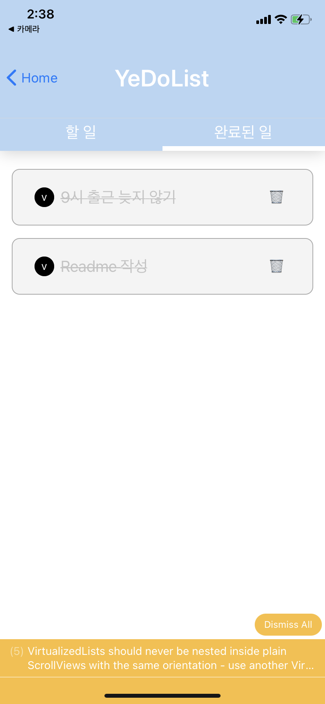

# ToDoList_react_native

react-native로 ToDoList 구현

## 기술 스택

- React, React-native
- Javascript, TypeScript
- Redux
- Hooks
- expo

## 구현 사항

- navigation-stack을 사용한 컴포넌트 이동(stack이 쌓임)
- FlatList를 사용한 컴포넌트의 재사용
- Redux를 사용한 State의 전역 관리
- Custom Hook을 만들어 자주 사용하는 로직 재사용
- TextInput을 사용해 할일 추가 기능 구현
  => keyboardavoidingview, Keyboard, Keyboard event를 사용해 기기에 맞게 키보드 창 올라올 경우 footer가 올라가는 기능 구현
- 할일 터치시 완료된 일로 이동 후 체크되는 기능 구현
- 삭제버튼 터치시 삭제되는 기능 구현

## 스크린샷

